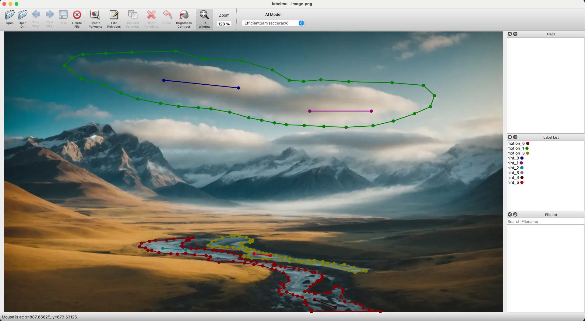

<h2 align="center">Optimizing 4D Gaussians for Dynamic Scene Video<br>from Single Landscape Images</h2>
<p align="center">
  <a href="https://www.pnu-cvsp.com/members/inhwan"><strong>In-Hwan Jin</strong></a>
  ·  
  <a href="https://www.pnu-cvsp.com/members/haesoo"><strong>Haesoo Choo</strong></a>
  ·  
  <a href="https://www.pnu-cvsp.com/members/shj"><strong>Seong-Hun Jeong</strong></a>
  ·    
  <strong>Park Heemoon</strong>
  ·  
  <strong>Junghwan Kim</strong>
  ·  
  <strong>Oh-joon Kwon</strong>
  ·  
  <a href="https://www.pnu-cvsp.com/prof"><strong>Kyeongbo Kong</strong></a>
  <br>
  ICLR 2025
</p>

<p align="center">
  <a href="https://cvsp-lab.github.io/ICLR2025_3D-MOM/"><strong><code>Project Page</code></strong></a>
  <a href="https://iclr.cc/virtual/2025/poster/30162"><strong><code>ICLR Paper</code></strong></a>
  <a href="https://github.com/InHwanJin/3DMOM"><strong><code>Source Code</code></strong></a>
</p>
<div align='center'>
  <br>
  <br>Generated Dynamic Scene Video from 3D-MOM.
</div>

## Setup

### Environment Setup
Clone the source code of this repo.
```shell
git clone https://github.com/InHwanJin/3DMOM.git
cd 3d-MOM
git submodule update --init --recursive
```

Installation through pip is recommended. First, set up your Python environment:
```shell
conda create -n 3D-MOM python=3.7 
conda activate Gaussians4D
```
Make sure to install CUDA and PyTorch versions that match your CUDA environment. We've tested on NVIDIA GeForce RTX 3090 with PyTorch  version 1.13.1.
Please refer https://pytorch.org/ for further information.

```shell
pip install torch
```

The remaining packages can be installed with:

```shell
pip install -r requirements.txt
pip install -e submodules/depth-diff-gaussian-rasterization
pip install -e submodules/simple-knn
```


### Download Checkpoints
We use the pre-trained **Flow Estimation Model** and **Video Generator Model**. You can download them at [3d-cinemagraphy](https://github.com/xingyi-li/3d-cinemagraphy?tab=readme-ov-file) for the Flow Estimation Model and [StyleCineGAN](https://github.com/jeolpyeoni/StyleCineGAN) for the Video Generator Model.

After downloading, place the models in the `ckpts` folder inside the respective directories under `thirdparty`.

## Preprocess Data
Firstly, use [labelme](https://github.com/wkentaro/labelme) to specify the target regions (masks) and desired movement directions (hints): 
```shell
conda activate 3D-MOM
cd demo/scene_0/
labelme image.png
```
A screenshot here:


It is recommended to specify **short** hints rather than long hints to avoid artifacts. Please follow [labelme](https://github.com/wkentaro/labelme) for detailed instructions if needed.

After that, we can obtain an image.json file. Our next step is to convert the annotations stored in JSON format into datasets that can be used by our method:
```shell
labelme_json_to_dataset image.json  # this will generate a folder image_json
cd ../../
python scripts/generate_mask.py --inputdir demo/0/image_json
```


## Training
For generate multi-view images and optimize 3d motion, run
```shell
# First, generate multi-view image and flow from single image 
python train_motion.py --input_dir demo/scene_0
```
- `input_dir`: input folder that contains src images.

For optimize 4D Gaussians and rendering dynamic scene video, run
```shell
# Second, reconstruct 4d scene from generated images and motions 
python train_4DGS.py --input_dir demo/scene_0 --flow_scale 2

python render_4DGS.py --input_dir demo/scene_0

```
- `flow_scale`: scale difference 3D motion(Point Cloud) and Gaussians.
Results will be saved to the `input_dir/video`.

## 📖 Citation
If you find this code useful for your research, please consider to cite our paper:)

```bibtex
@inproceedings{jinoptimizing,
  title={Optimizing 4D Gaussians for Dynamic Scene Video from Single Landscape Images},
  author={Jin, In-Hwan and Choo, Haesoo and Jeong, Seong-Hun and Heemoon, Park and Kim, Junghwan and Kwon, Oh-joon and Kong, Kyeongbo},
  booktitle={The Thirteenth International Conference on Learning Representations},
  year={2025}
}
```
